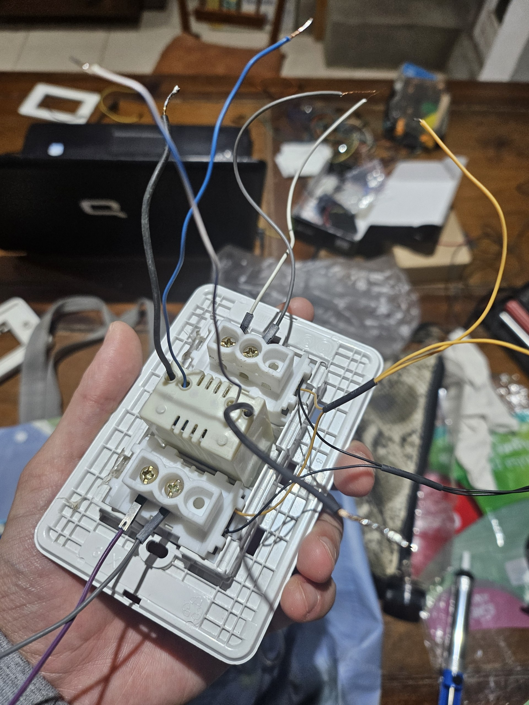
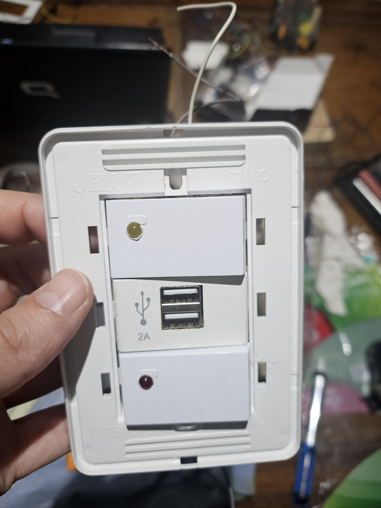

# 🔘 Flush-Mount Smart Wall Switch & Alarm Gateway (ESPHome)

A practical, clean-installation IoT solution designed to solve real-world usability constraints in home automation. Converts standard physical wall switches into a multi-device Home Assistant trigger (alarm system toggle & Tuya/SmartLife cloud light bridge) using an **ESP8266 (D1 Mini)** powered by an embedded 2A USB step-down module—keeping all wiring completely concealed inside the electrical wall box.

---

## 📌 Problem & Engineering Solution

* **The Problem:** 
  * The residence required a physical, accessible way to arm/disarm the backyard security alarm and control outdoor lights without relying on smartphones or app navigation.
  * Strict aesthetic requirement: **Zero visible wiring, external power bricks, or trunking**.
  * Need for immediate physical status feedback: Owners required an at-a-glance status check to know if the alarm or lights were active before stepping outside.

* **The Solution:** 
  * Integrated a compact 2A AC-to-DC USB power supply inside the standard wall switch box.
  * Interfaced two physical gang switches and modified them with **embedded status indicator LEDs** driven by the Wemos D1 Mini.
  * Implemented **bi-directional state synchronization**: Changing state via the physical switch, Home Assistant dashboard, or Tuya/SmartLife app instantly updates the LED indicators and physical/digital UI everywhere.

---

## 📸 Assembly & Installation Gallery

| Wall Box Wiring & USB PSU Integration | D1 Mini Interfacing & Final Mounting |
| :---: | :---: |
|  |  |

---

## 🏗️ Hardware Architecture & System Flow

```
[ 220V Mains Power ]
        │
        ├───────────────────────────► [ Physical Gang Switches (2x) ] ◄─── (Bi-directional LED Feedback)
        │                                         │
        ▼                                         ▼ (GPIO Input Signals)
[ 2A USB Power Module (5V) ] ─────────► [ ESP8266 / D1 Mini ]
                                                  │
                                                  ▼ (Wi-Fi Native API)
                                    [ Home Assistant Core ]
                                              │
                    ┌─────────────────────────┴─────────────────────────┐
                    ▼                                                   ▼
     [ Security Alarm System ]                            [ Tuya / SmartLife Cloud ]
     (Arm / Disarm Backyard)                              (Outdoor Lights Integration)
```

---

## 🛠️ Technical Stack & Components

* **Microcontroller:** Wemos D1 Mini (ESP8266).
* **Power Supply:** Flush-mount 220V AC to 5V 2A DC USB step-down power converter.
* **Status Feedback:** Integrated 5V/3.3V LED indicators inside physical switch covers.
* **Firmware Platform:** ESPHome (YAML with internal pull-up GPIO configuration, status outputs, and software debouncing).
* **Integrations:** Home Assistant Core, Tuya / SmartLife Integration, Home Assistant Alarm Control Panel API.

---

## ⚙️ ESPHome Configuration Example (`wall-switch.yaml`)

```yaml
esphome:
  name: wall-switch-alarm-gateway
  platform: ESP8266
  board: d1_mini

wifi:
  ssid: !secret wifi_ssid
  password: !secret wifi_password

# --- LEDS INDICADORES DE ESTADO (FEEDBACK VISUAL) ---
output:
  - platform: gpio
    pin: GPIO12 # D6 - LED en tecla de Alarma
    id: led_alarm_status

  - platform: gpio
    pin: GPIO13 # D7 - LED en tecla de Luz Tuya
    id: led_light_status

light:
  - platform: binary
    name: "Alarm Status LED Indicator"
    output: led_alarm_status
    id: alarm_led

  - platform: binary
    name: "Outdoor Light LED Indicator"
    output: led_light_status
    id: light_led

# --- ENTRADAS DE TECLAS FÍSICAS ---
binary_sensor:
  # Tecla 1: Control de Alarma Patio
  - platform: gpio
    pin:
      number: GPIO4 # D2
      mode: INPUT_PULLUP
    name: "Physical Alarm Toggle Switch"
    id: switch_alarm
    filters:
      - delayed_on: 50ms
      - delayed_off: 50ms
    on_press:
      then:
        - homeassistant.service:
            service: alarm_control_panel.alarm_trigger
            data:
              entity_id: alarm_control_panel.backyard_alarm

  # Tecla 2: Bridge Luz Tuya / SmartLife
  - platform: gpio
    pin:
      number: GPIO5 # D1
      mode: INPUT_PULLUP
    name: "Physical Outdoor Light Switch"
    id: switch_tuya_light
    filters:
      - delayed_on: 50ms
      - delayed_off: 50ms
    on_toggle:
      then:
        - homeassistant.service:
            service: light.toggle
            data:
              entity_id: light.tuya_backyard_lights
```

---

## 👤 Author

* **Brian Alexander Salvagni Orozco** (`braai369`)
* *AI Specialist & Process Automation Engineer*
